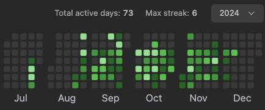

# Prep Tech 2024

I took part in the [Prep Tech 2024](https://ada.tech/oportunidades/google-prep-tech-2024) program, where I had the opportunity to revisit key computer science concepts, with a particular focus on problem-solving techniques and coding interviews. Below, you'll find artifacts and a history of my journey throughout the course.

Problem set history:

TODO

Prep Tech effect! Below are some of my active days practicing problem-solving on LeetCode throughout the program.

Check out my [LeetCode profile](https://leetcode.com/u/jefersonf/).

Course completion [certificate](https://ada.tech/certificado?code=0817c8af-05c7-4bc4-b3a8-0429bbc3459f).

